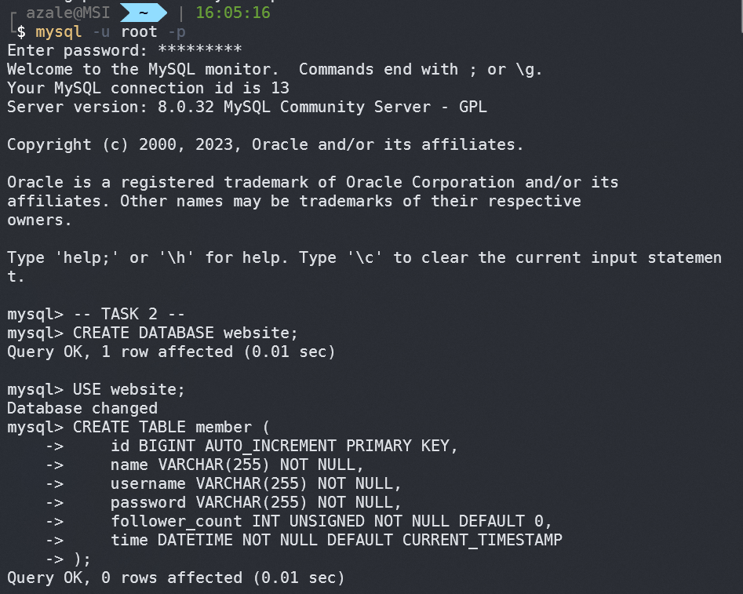
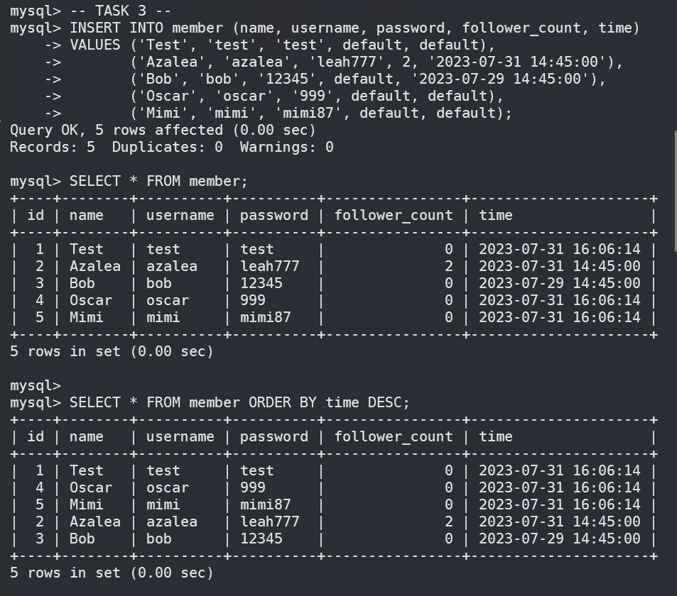
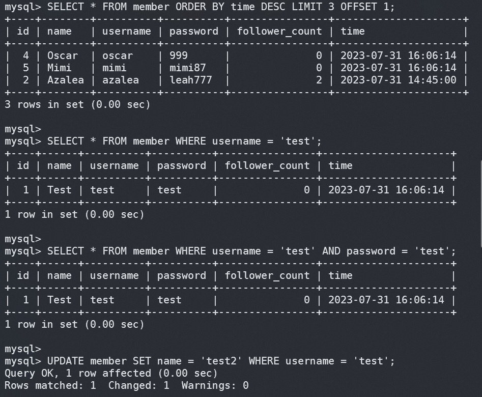
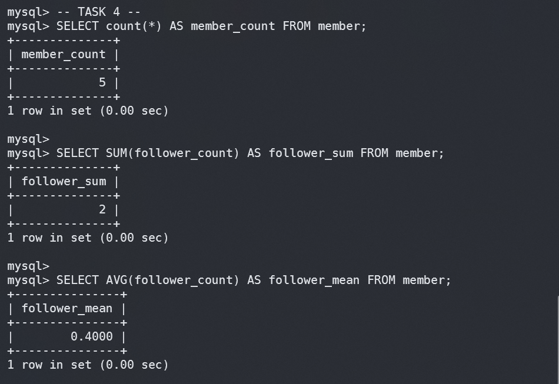
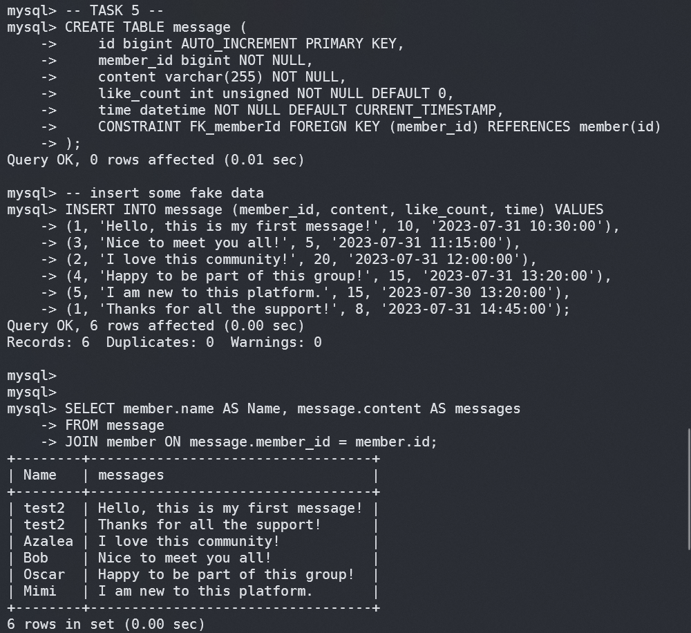
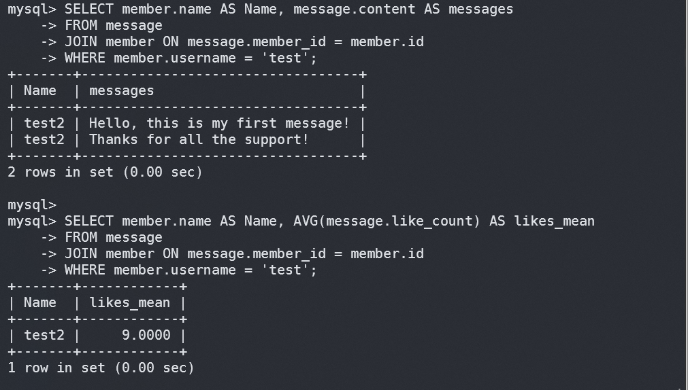

# week 5 Assignment: MySQL 資料庫與 SQL 操作

## Task 2：建立資料庫和資料表

```sql
CREATE DATABASE website;
USE website;
CREATE TABLE member (
    id BIGINT AUTO_INCREMENT PRIMARY KEY,
    name VARCHAR(255) NOT NULL,
    username VARCHAR(255) NOT NULL,
    password VARCHAR(255) NOT NULL,
    follower_count INT UNSIGNED NOT NULL DEFAULT 0,
    time DATETIME NOT NULL DEFAULT CURRENT_TIMESTAMP
);
```



## Task 3：SQL CRUD

### SQL code & Output screenshot (1/2)

```sql
INSERT INTO member (name, username, password, follower_count, time)
VALUES ('Test', 'test', 'test', default, default),
       ('Azalea', 'azalea', 'leah777', 2, '2023-07-31 14:45:00'),
       ('Bob', 'bob', '12345', default, '2023-07-29 14:45:00'),
       ('Oscar', 'oscar', '999', default, default),
       ('Mimi', 'mimi', 'mimi87', default, default);

SELECT * FROM member;

SELECT * FROM member ORDER BY time DESC;
```



### SQL code & Output screenshot (2/2)

```sql
SELECT * FROM member ORDER BY time DESC LIMIT 3 OFFSET 1;

SELECT * FROM member WHERE username = 'test';

SELECT * FROM member WHERE username = 'test' AND password = 'test';

UPDATE member SET name = 'test2' WHERE username = 'test';
```



## Task 4：SQL Aggregate Functions

```sql
SELECT count(*) AS member_count FROM member;

SELECT SUM(follower_count) AS follower_sum FROM member;

SELECT AVG(follower_count) AS follower_mean FROM member;
```



## Task 5：SQL JOIN

### SQL code & Output screenshot (1/2)

```sql
CREATE TABLE message (
    id bigint AUTO_INCREMENT PRIMARY KEY,
    member_id bigint NOT NULL,
    content varchar(255) NOT NULL,
    like_count int unsigned NOT NULL DEFAULT 0,
    time datetime NOT NULL DEFAULT CURRENT_TIMESTAMP,
    CONSTRAINT FK_memberId FOREIGN KEY (member_id) REFERENCES member(id)
);
-- insert some fake data
INSERT INTO message (member_id, content, like_count, time) VALUES
(1, 'Hello, this is my first message!', 10, '2023-07-31 10:30:00'),
(3, 'Nice to meet you all!', 5, '2023-07-31 11:15:00'),
(2, 'I love this community!', 20, '2023-07-31 12:00:00'),
(4, 'Happy to be part of this group!', 15, '2023-07-31 13:20:00'),
(5, 'I am new to this platform.', 15, '2023-07-30 13:20:00'),
(1, 'Thanks for all the support!', 8, '2023-07-31 14:45:00');

SELECT member.name AS Name, message.content AS messages
FROM message
JOIN member ON message.member_id = member.id;
```



### SQL code & Output screenshot (2/2)

```sql
SELECT member.name AS Name, message.content AS messages
FROM message
JOIN member ON message.member_id = member.id
WHERE member.username = 'test';

SELECT member.name AS Name, AVG(message.like_count) AS likes_mean
FROM message
JOIN member ON message.member_id = member.id
WHERE member.username = 'test';
```


